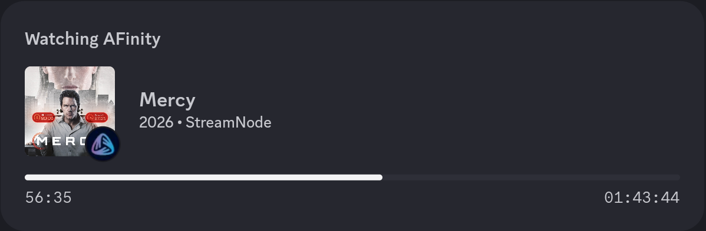
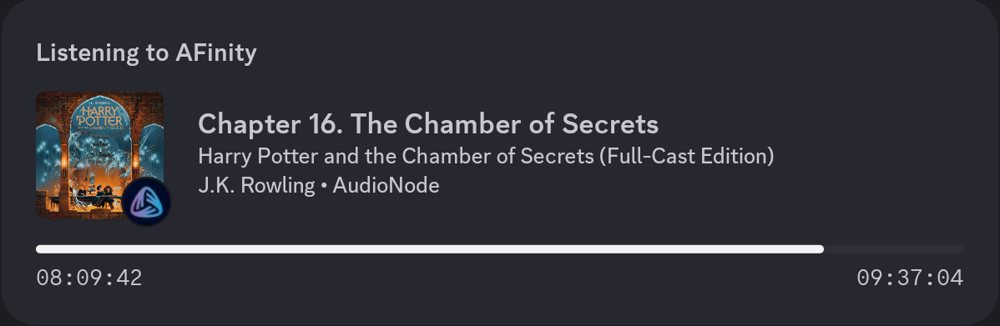

# Discord Media RPC

A Discord Rich Presence client that shows what you're watching on Jellyfin or listening to on Audiobookshelf — with cover art, timestamps, and chapter tracking.

<p align="center">
  
  &nbsp;
  
  &nbsp;
</p>

<div align="center">
  
  <a href="https://github.com/MakD/media-rpc/releases"></a>
</div>

---

## Features

- Jellyfin support — movies and TV shows with cover art (falls back to TMDB)
- Audiobookshelf support — audiobooks and podcasts with chapter tracking
- Cover art fetched directly from your media servers
- Elapsed and remaining time timestamps
- Library blacklist to hide specific Jellyfin libraries
- Auto-reconnect if Discord connection drops
- Local cover cache to avoid redundant requests

---

## Requirements

- Python 3.8+
- A running [Jellyfin](https://jellyfin.org/) and/or [Audiobookshelf](https://www.audiobookshelf.org/) instance
- A [Discord application](https://discord.com/developers/applications) with a Client ID
- A reverse proxy (Caddy, Nginx, Apache, Traefik) with a public domain for ABS cover art — see [Cover Art Setup](#cover-art-setup)

---

## Installation

**1. Clone the repository:**
```bash
git clone https://github.com/MakD/media-rpc.git
cd media-rpc
```

**2. Install dependencies:**
```bash
pip install requests
```

**3. Configure the script** — open `media_rpc.py` and fill in your details:

```python
DISCORD_CLIENT_ID = "YOUR_DISCORD_APPLICATION_ID"

# Jellyfin
JELLYFIN_SERVER = "https://your-jellyfin-domain.com/Sessions"
JELLYFIN_API_KEY = "YOUR_JELLYFIN_API_KEY"
TMDB_API_KEY = "YOUR_TMDB_API_KEY"

# Audiobookshelf
ABS_SERVER = "https://your-abs-domain.com"
ABS_API_TOKEN = "YOUR_ABS_API_TOKEN"
```

**4. Run:**
```bash
python3 media_rpc.py
```

---

## Configuration

### Discord Application ID
1. Go to the [Discord Developer Portal](https://discord.com/developers/applications)
2. Create a new application
3. Copy the **Application ID** (not a bot token) into `DISCORD_CLIENT_ID`

### Jellyfin API Key
1. In Jellyfin, go to **Dashboard → API Keys**
2. Create a new key and paste it into `JELLYFIN_API_KEY`

### Audiobookshelf API Token
1. In Audiobookshelf, go to **Settings → Users**
2. Click your user and copy the **API Token**

### TMDB API Key (optional, Jellyfin cover fallback)
1. Create an account at [themoviedb.org](https://www.themoviedb.org/)
2. Go to **Settings → API** and request a key

### Library Blacklist (optional)
To hide specific Jellyfin libraries from showing in RPC:
```python
JELLYFIN_IGNORE_LIBRARIES = ["Bollywood", "Kids"]
```

---

## Cover Art Setup

Discord fetches cover images directly from the URL you provide, which means your media server needs to be publicly accessible. Since Audiobookshelf requires authentication, you need to set up an **authenticated proxy route** in your reverse proxy. This lets Discord access cover art via a short clean URL, while your token stays on the server and is never exposed.

This only makes cover artwork publicly accessible — not your audio files or any other data.

### Caddy
```
your-abs-domain.com {
    handle /cover/* {
        rewrite * /api/items/{http.request.uri.path.1}/cover
        reverse_proxy localhost:13378 {
            header_up Authorization "Bearer YOUR_ABS_TOKEN"
        }
    }

    reverse_proxy localhost:13378
}
```

### Nginx
```nginx
location /cover/ {
    rewrite ^/cover/(.*)$ /api/items/$1/cover break;
    proxy_pass http://localhost:13378;
    proxy_set_header Authorization "Bearer YOUR_ABS_TOKEN";
}
```

### Apache
```apache
RewriteRule ^/cover/(.*)$ /api/items/$1/cover [PT]
RequestHeader set Authorization "Bearer YOUR_ABS_TOKEN"
ProxyPass /cover/ http://localhost:13378/api/items/
```

After setup, test it by opening this in your browser (no login required):
```
https://your-abs-domain.com/cover/ANY_LIBRARY_ITEM_ID
```

For Jellyfin, no extra proxy setup is needed — cover art is fetched using your API key directly.

---

## Running as a Service

To run the script automatically on login:

**1. Create a systemd service:**
```bash
sudo nano /etc/systemd/system/media-rpc.service
```

**2. Paste the following (update paths and username):**
```ini
[Unit]
Description=Media Discord RPC
After=network.target

[Service]
User=YOUR_USERNAME
WorkingDirectory=/path/to/media-rpc
ExecStart=/usr/bin/python3 /path/to/media-rpc/media_rpc.py
Restart=always
RestartSec=10
Environment=DISPLAY=:0
Environment=XDG_RUNTIME_DIR=/run/user/YOUR_USER_ID

[Install]
WantedBy=default.target
```

**3. Enable and start:**
```bash
sudo systemctl daemon-reload
sudo systemctl enable media-rpc
sudo systemctl start media-rpc
```

---

## How It Works

Every 15 seconds the script polls your media servers for active sessions. If something is playing, it constructs a Rich Presence payload with the title, state, timestamps, and cover art, then sends it to Discord over a local Unix socket. Cover URLs are cached in `cover_cache.json` so they are only fetched once per item. If nothing is playing, the presence is cleared.

---

## Troubleshooting

**RPC not showing**
- Make sure Discord is running and your status is not set to invisible
- Confirm `DISCORD_CLIENT_ID` is the Application ID, not a bot token

**Cover art showing a dice/placeholder icon**
- Your image URL is likely not publicly accessible, or exceeds Discord's 256 character URL limit
- Follow the [Cover Art Setup](#cover-art-setup) instructions for your reverse proxy

**Audiobookshelf not showing**
- The script detects playback by comparing position between polls — it needs two cycles to confirm something is playing, so there may be a brief delay on startup
- Make sure `ABS_SERVER` has no trailing slash

**Jellyfin not showing**
- Paused sessions are intentionally ignored
- Check that your `JELLYFIN_API_KEY` is valid and your server is reachable
