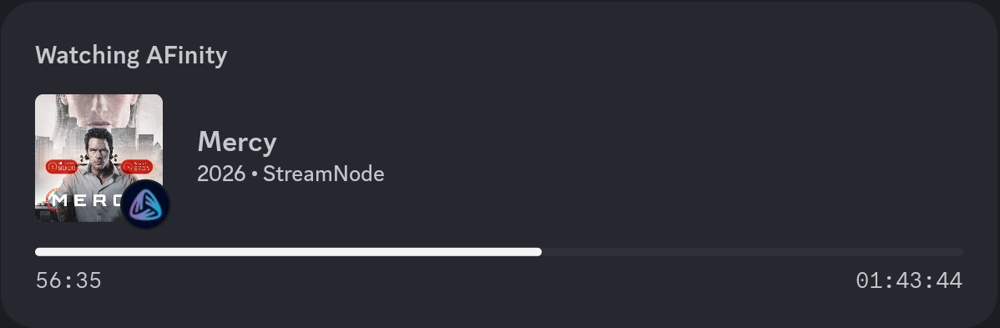
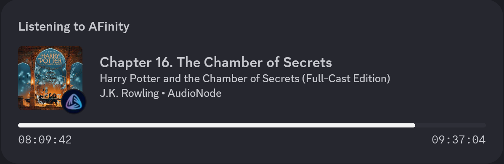

# Discord Media RPC

A Discord Rich Presence client that shows what you're watching on Jellyfin or listening to on Audiobookshelf - with cover art, timestamps, and chapter tracking.

<p align="center">
  
</p>
<p align="center">
  
</p>

<div align="center">
  
  <a href="https://github.com/MakD/media-rpc/releases"></a>
</div>

---

## Runners

### script

media_rpc.py

### docker

in addition, you can run it in docker, either building it yourself, or using
https://hub.docker.com/repository/docker/simoneklundh/media-rpc

---

## Features

- Jellyfin support - movies and TV shows with cover art (falls back to TMDB)
- Audiobookshelf support - audiobooks and podcasts with chapter tracking
- **Privacy-focused** - filters by your specific User ID so your friends' streams don't show on your profile
- **Secure Configuration** - uses a `.env` file to keep your API tokens and IDs safe
- Cover art fetched directly from your media servers
- Elapsed and remaining time timestamps
- Library blacklist to hide specific Jellyfin libraries (cached for performance)
- Auto-reconnect if Discord connection drops
- Local cover cache to avoid redundant requests
- Can optionally be ran without discord running

---

## Requirements

### script version

- Python 3.10+ (for mac this might require homebrew)

### docker version

- docker

### both
- A running [Jellyfin](https://jellyfin.org/) and/or [Audiobookshelf](https://www.audiobookshelf.org/) instance
- A [Discord application](https://discord.com/developers/applications) with a Client ID
- A reverse proxy (Caddy, Nginx, Apache, Traefik) with a public domain for ABS cover art - see [Cover Art Setup](#cover-art-setup)

---

## Installation

### Docker Compose version
```yaml
services:
  media-rpc:
    image: simoneklundh/media-rpc:2
    container_name: media-rpc
    restart: unless-stopped
    environment:
      - DISCORD_CLIENT_ID=idhere
      - DISCORD_TOKEN=tokenhere
      - JELLYFIN_SERVER=https://jellyfin.domain.tld/Sessions
      - JELLYFIN_API_KEY=apikeyhere
      - JELLYFIN_USER_ID=useridhere
      - TMDB_API_KEY=api_key_here
      - ABS_SERVER=https://books.domain.tld
      - ABS_API_TOKEN=apitokenhere
      - USE_CHAPTER_TITLE=true
      - DEFAULT_JELLYFIN_SERVER_NAME= Custom Server Name
      - DEFAULT_AUDIOBOOKSHELF_SERVER_NAME= Custom Server Name
      - JELLYFIN_IGNORE_LIBRARIES=Library1,Library2,Library3
      - USE_GATEWAY=true
```
[How to get the variables](#Configuration)  

[How To Get Audiobookshelf Images In Discord](#Cover-Art-Setup)

### venv version (recommended for non-docker use)

**1. Clone the repository:**
```bash
git clone https://github.com/MakD/media-rpc.git
cd media-rpc
```
**2. Create and source virtual environment**
```bash
# python or python3 depending on your setup
python -m venv venv

# linux/mac
source venv/bin/activate (or activate.fish for fish users)
# windows powershell:
./venv/bin/Activate.ps1
# in case of permission errors, run this and then retry:
Set-ExecutionPolicy -ExecutionPolicy RemoteSigned -Scope CurrentUser
```

**3. Install dependencies:**

```bash
pip install -r requirements.txt

```

**4. Configure the script:**

```bash
# discord (DISCORD_TOKEN is only required for the gateway version)
DISCORD_TOKEN=YOUR_DISCORD_TOKEN
DISCORD_CLIENT_ID=YOUR_DISCORD_CLIENT_ID
# jellyfin
JELLYFIN_SERVER=https://jellyfin.example.com/Sessions
JELLYFIN_API_KEY=YOUR_JELLYFIN_API_KEY
JELLYFIN_USER_ID=YOUR_JELLYFIN_USER_ID
TMDB_API_KEY=YOUR_TMDB_API_KEY
# audiobookshelf
ABS_SERVER=https://abs.example.com
ABS_API_TOKEN=YOUR_ABS_API_TOKEN
# optional, defaults to true
USE_CHAPTER_TITLE=true
#optional, defaults to empty string
DEFAULT_JELLYFIN_SERVER_NAME=jellfin_server_name 
#optional, defaults to empty string
DEFAULT_AUDIOBOOKSHELF_SERVER_NAME=audiobookshelf_server_name 
#optional, defaults to empty list
JELLYFIN_IGNORE_LIBRARIES=library1,library2
# true => use gateway, false => use rpc (requires discord running on your computer)
# defaults to false
USE_GATEWAY=true
```
**5. Run media-rpc:**
```bash
python media_rpc.py
```

## global version (not recommended)

**1. Clone the repository:**
```bash
git clone https://github.com/MakD/media-rpc.git
cd media-rpc
```

**2. Install dependencies:**
```bash
pip install -r requirements.txt
```

**3. Configure the script:** Create a new file named `.env` in the same directory as the script and fill in your details:

```bash
# discord (DISCORD_TOKEN is only required for media_rpc_gateway.py)
DISCORD_TOKEN=YOUR_DISCORD_TOKEN
DISCORD_CLIENT_ID=YOUR_DISCORD_CLIENT_ID
# jellyfin
JELLYFIN_SERVER=https://jellyfin.example.com/Sessions
JELLYFIN_API_KEY=YOUR_JELLYFIN_API_KEY
JELLYFIN_USER_ID=YOUR_JELLYFIN_USER_ID
TMDB_API_KEY=YOUR_TMDB_API_KEY
# audiobookshelf
ABS_SERVER=https://abs.example.com
ABS_API_TOKEN=YOUR_ABS_API_TOKEN
# optional, defaults to true
USE_CHAPTER_TITLE=true
# optional, defaults to false
USE_CHAPTER_TIMESTAMPS=false
#optional, defaults to empty string
DEFAULT_JELLYFIN_SERVER_NAME=jellfin_server_name 
#optional, defaults to empty string
DEFAULT_AUDIOBOOKSHELF_SERVER_NAME=audiobookshelf_server_name 
#optional, defaults to empty list
JELLYFIN_IGNORE_LIBRARIES=library1,library2
# defaults to false. true => use the gateway, no discord client needed. requires DISCORD_TOKEN
USE_GATEWAY=true
```

**4. Run manually to test:**
```bash
python3 media_rpc.py
```
---

## Configuration

### Discord Application ID
1. Go to the [Discord Developer Portal](https://discord.com/developers/applications)
2. Create a new application
3. Copy the **Application ID** (not a bot token) into `DISCORD_CLIENT_ID`

### Discord User Token
1. log into discord in the browser
2. open browser dev tools (usually ctrl+shift+i or cmd+shift+i)
3. open the network tab
4. refresh page
5. in the search field: search for credentials
6. click the credentials item
7. under "Request Headers", find the "Authorization" part.
8. copy the value and put it into `DISCORD_TOKEN`

it should look something like this `MTIzNDU2Nzg5MDEyMzQ1Njc4.GxKp2A.aBcDeFgHiJkLmNoPqRsTuVwXyZ0123456789ab`

### Jellyfin API Key
1. In Jellyfin, go to **Dashboard → API Keys**
2. Create a new key and paste it into `JELLYFIN_API_KEY`

### Jellyfin User ID (Required for Privacy)
To ensure Discord only shows what *you* are watching and ignores other users on your server:
1. Open your Jellyfin web dashboard.
2. Go to **Dashboard → Users** and click on your user profile.
3. Look at the URL in your browser. Copy the long string of letters and numbers after `userId=`. 
4. Paste it into `JELLYFIN_USER_ID` in your `.env` file.

### Audiobookshelf API Token
1. In Audiobookshelf, go to **Settings → Users**
2. Click your user and copy the **API Token**

### TMDB API Key (optional, Jellyfin cover fallback)
1. Create an account at [themoviedb.org](https://www.themoviedb.org/)
2. Go to **Settings → API** and request a key

### Library Blacklist (optional)
To hide specific Jellyfin libraries from showing in RPC, edit the list in the .env or the variable `JELLYFIN_IGNORE_LIBRARIES` in the compose:
```python
JELLYFIN_IGNORE_LIBRARIES = ["Bollywood", "Kids"]
```
```compose
JELLYFIN_IGNORE_LIBRARIES=Bollywood,Kids
```
### Gateway
To use the discord gateway instead of rpc, add
USE_GATEWAY=true and the Discord Token to the .env
---

## Cover Art Setup

Discord fetches cover images directly from the URL you provide, which means your media server needs to be publicly accessible. Since Audiobookshelf requires authentication, you need to set up an **authenticated proxy route** in your reverse proxy. This lets Discord access cover art via a short, clean URL, while your token stays on the server and is never exposed.

This only makes cover artwork publicly accessible - not your audio files or any other data.

### Caddy
```caddy
your-abs-domain.com {
    handle /cover/* {
        rewrite * /api/items/{http.request.uri.path.1}/cover
        reverse_proxy localhost:13378 {
            header_up Authorization "Bearer YOUR_ABS_TOKEN"
        }
    }

    reverse_proxy localhost:13378
}
```

### Nginx
```nginx
location /cover/ {
    rewrite ^/cover/(.*)$ /api/items/$1/cover break;
    proxy_pass http://localhost:13378;
    proxy_set_header Authorization "Bearer YOUR_ABS_TOKEN";
}
```

### Apache
```apache
RewriteRule ^/cover/(.*)$ /api/items/$1/cover [PT]
RequestHeader set Authorization "Bearer YOUR_ABS_TOKEN"
ProxyPass /cover/ http://localhost:13378/api/items/
```

After setup, test it by opening this in your browser (no login required):
```
[https://your-abs-domain.com/cover/ANY_LIBRARY_ITEM_ID](https://your-abs-domain.com/cover/ANY_LIBRARY_ITEM_ID)
```

For Jellyfin, no extra proxy setup is needed - cover art is fetched using your API key directly.

---

## Running as a Background Service (Linux)

Because Discord runs under your personal user account, this must be set up as a **User Service**, not a system-wide root service. Do not use `sudo` for these steps.

**1. Create the user systemd directory:**
```bash
mkdir -p ~/.config/systemd/user
```

**2. Create the service file:**
```bash
nano ~/.config/systemd/user/media-rpc.service
```

**3. Paste the following configuration:**
*(Make sure to replace `/home/YOUR_USERNAME/path/to/` with the actual absolute path to your cloned folder!)*
```ini
[Unit]
Description=Media Discord RPC
After=network.target

[Service]
Type=simple
ExecStart=/usr/bin/python3 /home/YOUR_USERNAME/path/to/media-rpc/media_rpc_gateway.py # or use local if you want to run discord still
WorkingDirectory=/home/YOUR_USERNAME/path/to/media-rpc/
Restart=always
RestartSec=10

[Install]
WantedBy=default.target
```

**4. Enable and start the service:**
```bash
systemctl --user daemon-reload
systemctl --user enable --now media-rpc.service
```

**5. Check the live logs:**
```bash
journalctl --user -u media-rpc.service -f
```

---

## How It Works

Every 15 seconds, the script polls your media servers for active sessions. If something is playing, it constructs a Rich Presence payload with the title, state, timestamps, and cover art, then sends it to Discord over a local Unix socket. Cover URLs are cached in `cover_cache.json` so they are only fetched once per item. If nothing is playing, the presence is cleared.

---

## Troubleshooting

**RPC not showing**
- Make sure Discord is running, and your status is not set to invisible
- Confirm `DISCORD_CLIENT_ID` is the Application ID, not a bot token

**Cover art showing a dice/placeholder icon**
- Your image URL is likely not publicly accessible, or exceeds Discord's 256-character URL limit
- Follow the [Cover Art Setup](#cover-art-setup) instructions for your reverse proxy

**Audiobookshelf not showing**
- The script detects playback by comparing the position between polls - it needs two cycles to confirm something is playing, so there may be a brief delay on startup
- Make sure `ABS_SERVER` has no trailing slash

**Jellyfin not showing**
- Paused sessions are intentionally ignored
- Check that your `JELLYFIN_API_KEY` is valid and your server is reachable
